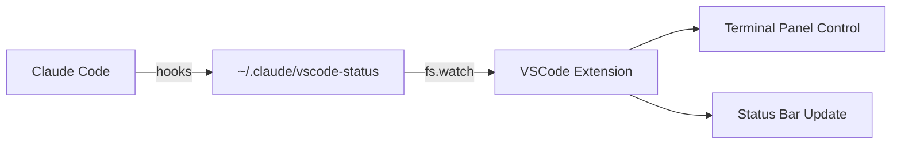

# Claude Code Focus

A VSCode extension that automatically controls the terminal panel based on Claude Code's status.

While Claude Code is working autonomously, the terminal panel is closed to maximize your editor space. When user input is needed, the terminal opens and focuses automatically.

## Behavior

| Status | Terminal Panel | Status Bar |
|---|---|---|
| `working` | Close | 🤖 Claude: Working |
| `waiting` | Open + Focus | ⚠️ Claude: Needs Input |
| `idle` | Close | ✅ Claude: Done |
| On startup | No change | 💤 Claude: Idle |

> **Note:** When the status is `working` or `idle`, the entire bottom panel is closed — not just the terminal. If you have the Problems or Output panel open, it will also be closed.

## How It Works



| Hook Event | Status File | Extension Action |
|---|---|---|
| `Notification` | `waiting` | Open terminal + focus |
| `PostToolUse` | `working` | Close panel |
| `Stop` | `idle` | Close panel |

## Setup

### 1. Install the Extension

Search for **"Claude Code Focus"** in the VSCode Extensions panel, or run:

```
ext install HayaShin5.claude-code-focus
```

### 2. Configure Claude Code Hooks

Open the Command Palette (`Cmd+Shift+P`) and run:

```
Claude Code Focus: Setup Hooks
```

This automatically adds the required hooks to `~/.claude/settings.json`.

<details>
<summary>Manual setup</summary>

Add the following to your `~/.claude/settings.json`:

```json
{
  "hooks": {
    "Notification": [
      {
        "matcher": "",
        "hooks": [
          { "type": "command", "command": "echo 'waiting' > ~/.claude/vscode-status" }
        ]
      }
    ],
    "PostToolUse": [
      {
        "matcher": "",
        "hooks": [
          { "type": "command", "command": "echo 'working' > ~/.claude/vscode-status" }
        ]
      }
    ],
    "Stop": [
      {
        "matcher": "",
        "hooks": [
          { "type": "command", "command": "echo 'idle' > ~/.claude/vscode-status" }
        ]
      }
    ]
  }
}
```

</details>

## Development

```bash
npm install
npm run watch
```

Press `F5` to launch the extension in debug mode. To test manually:

```bash
echo 'waiting' > ~/.claude/vscode-status
echo 'working' > ~/.claude/vscode-status
echo 'idle' > ~/.claude/vscode-status
```

## License

MIT
